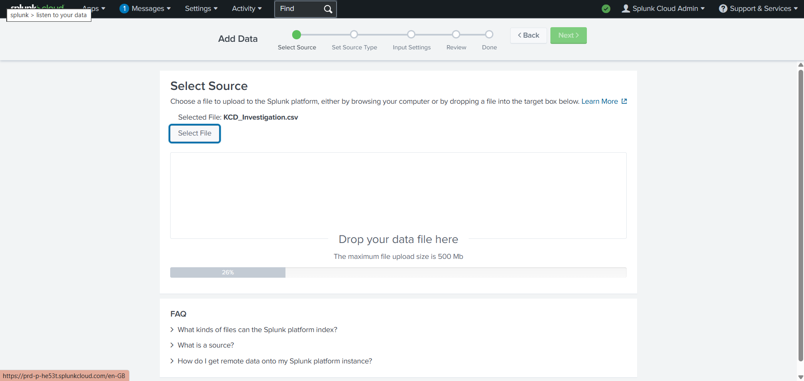
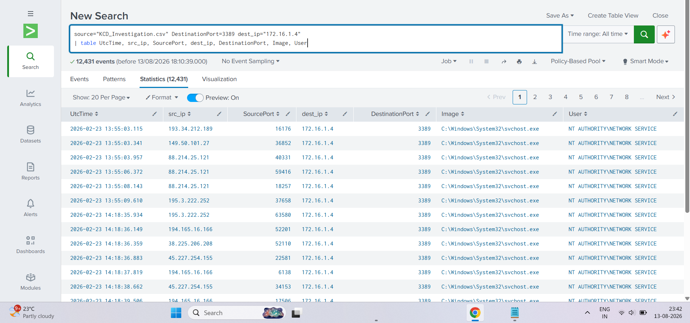
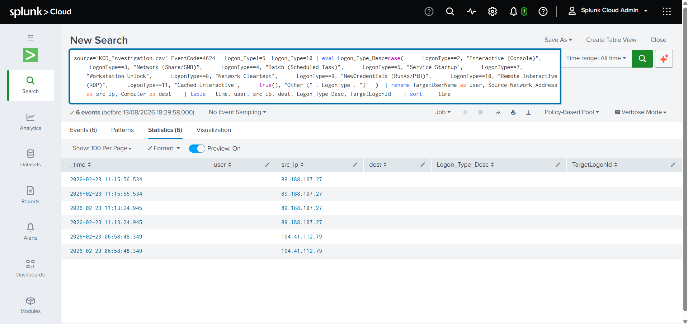
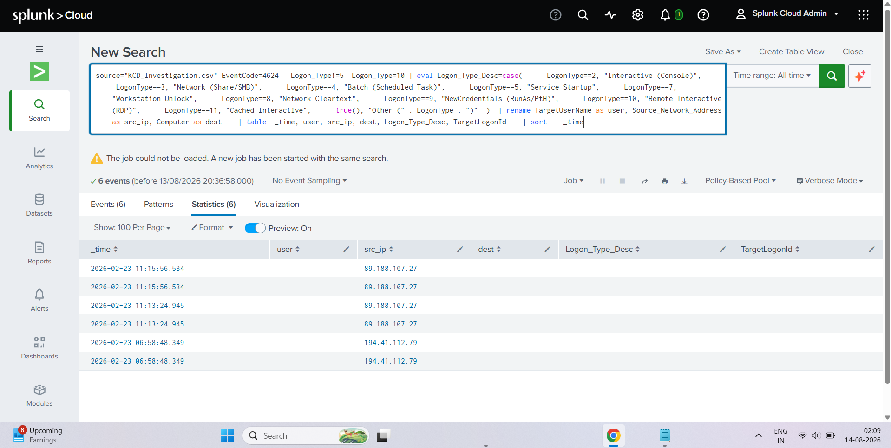
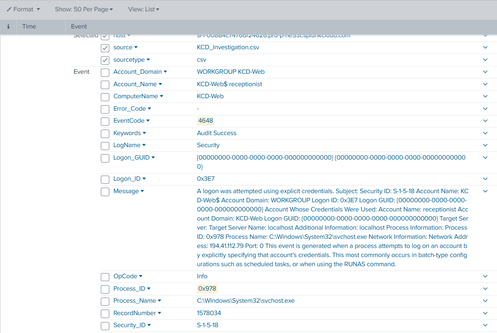
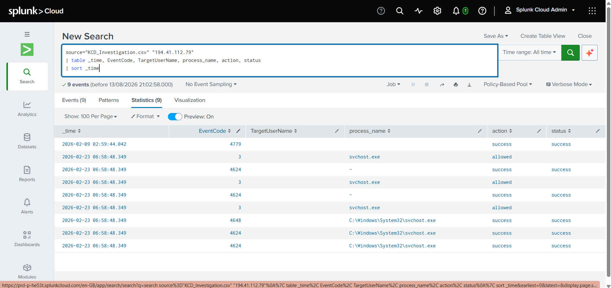
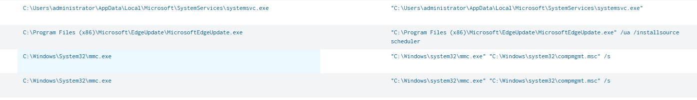
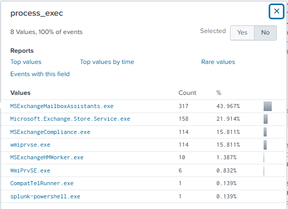
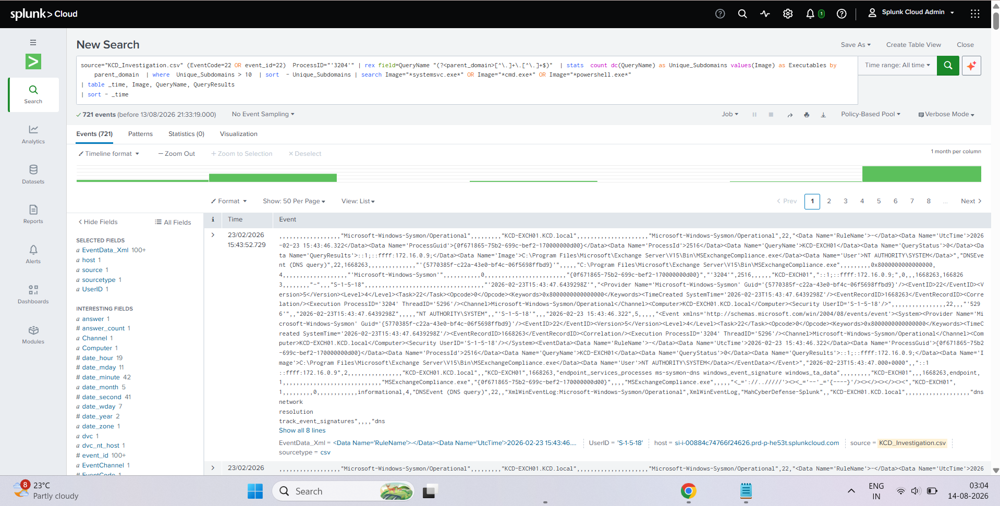

# INC-2026-0223-KCD — RDP Compromise & Malicious Binary Execution

**Severity:** HIGH / CRITICAL
**Target Host:** `KCD-Web` (172.16.1.4)
**Date of Occurrence:** February 23, 2026
**Prepared By:** Tier 2 / Lead SOC Analyst

---

# Part 1 — Executive Incident Report

## Executive Summary

On February 23, 2026, Security Operations detected an unauthorized access
incident targeting host `KCD-Web` (172.16.1.4). An external actor operating
from IP address `194.41.112.79` conducted a distributed RDP password spraying
attack against multiple domain and local accounts.

The attacker successfully authenticated to the `receptionist` account via
Remote Desktop (RDP) at **06:58:48 UTC**, followed by administrative
credential escalation to the `administrator` account at **11:13:24 UTC**.
Following access, a malicious binary masquerading as a Windows system service
(`systemsvc.exe`) was executed from a user `AppData` directory, and
interactive management tools (`mmc.exe`) were launched to inspect host
configuration.

No active outbound DNS Command & Control (C2) or data exfiltration channels
were established; the attacker operated purely hands-on-keyboard via the RDP
connection. Host isolation, process termination, and credential revocation
protocols have been initiated.

## Incident Overview & Classification

| Parameter | Details |
|---|---|
| Primary Host Impacted | KCD-Web (172.16.1.4) |
| Attacker Origin IP | 194.41.112.79 |
| Compromised Credentials | `receptionist`, `administrator` |
| Initial Access Vector | Internet-exposed RDP (TCP Port 3389) |
| Malicious Execution Path | `C:\Users\administrator\AppData\Local\Microsoft\SystemServices\systemsvc.exe` |

### MITRE ATT&CK Tactic Mapping

| Technique ID | Name | Evidence |
|---|---|---|
| T1110.003 | Password Spraying | High-volume inbound connections to TCP/3389 from many source IPs prior to successful auth. |
| T1021.001 | Remote Desktop Protocol | Successful RDP (Logon Type 10) authentication events (4624/4648). |
| T1036.005 | Masquerading | `systemsvc.exe` named/pathed to resemble a legitimate Windows service, run from `AppData\Local`. |
| T1078 | Valid Accounts | Attacker used valid `receptionist` and `administrator` credentials throughout. |

## Chronological Attack Timeline

| Timestamp (UTC) | Event Code / Source | Action & Investigation Findings |
|---|---|---|
| 2026-02-09 02:59:44 | Event 4779 | Historical user RDP session disconnect recorded on KCD-Web. |
| 2026-02-23 06:58:48 | Event 4624 / 4648 | **Initial Access Granted.** External IP `194.41.112.79` successfully authenticated as user `receptionist` using explicit credentials. |
| 2026-02-23 07:00:56 | Sysmon Event 1 | First interactive command shell (`cmd.exe`) spawned under the `receptionist` session context. |
| 2026-02-23 11:13:24 | Event 4624 / 4648 | **Privilege Escalation.** Attacker authenticated using explicit credentials for account `administrator`. |
| 2026-02-23 11:14:19 | Sysmon Event 1 | **Malware Execution.** Malicious binary `systemsvc.exe` executed from `C:\Users\administrator\AppData\Local\Microsoft\SystemServices\`. |
| 2026-02-23 11:15:06 | Sysmon Event 1 | Computer Management console (`mmc.exe` with `compmgmt.msc`) launched to inspect local users and shares. |

## Impact & Root Cause Analysis

**Root Cause:** Direct perimeter exposure of Windows Remote Desktop Protocol
(RDP Port 3389) without Multi-Factor Authentication (MFA) or automated account
lockout thresholds enabled password brute-forcing.

### Key Impact Findings

- **Unauthorized System Access:** Attacker gained full local administrative
  control over KCD-Web.
- **Defense Evasion:** Dropped executable utilized legitimate naming
  (`systemsvc.exe`) inside a user `AppData` path to evade basic process-name
  detection.
- **Data Access Scope:** Attacker accessed local management consoles; full
  file system triage is underway to confirm whether sensitive web application
  data was read or modified.

## Indicators of Compromise (IOCs)

| Type | Indicator | Impact / Context |
|---|---|---|
| IPv4 Address | `194.41.112.79` | External attacker infrastructure (inbound RDP brute force / initial access). |
| IPv4 Address | `89.188.107.27` | Secondary source IP observed during escalation / follow-on session activity. |
| File Path | `C:\Users\administrator\AppData\Local\Microsoft\SystemServices\systemsvc.exe` | Dropped malicious executable, masquerading as a Windows system service. |
| Process Command Line | `"C:\Windows\system32\mmc.exe" "C:\Windows\system32\compmgmt.msc" /s` | Post-compromise system/local-account enumeration activity. |
| User Account | `administrator` | Compromised local admin account — requires immediate password reset. |
| User Account | `receptionist` | Compromised low-privilege account used for initial access — requires immediate password reset. |
| Network Port | TCP/3389 (RDP) | Initial access vector — internet-exposed without MFA/lockout policy. |

## Remediation & Strategic Recommendations

### Immediate Containment Actions Taken

- Isolated host `172.16.1.4` from the production network segment.
- Terminated malicious process `systemsvc.exe` and associated interactive
  shells.
- Blocked external IP `194.41.112.79` at the perimeter firewall.
- Revoked active sessions and enforced password resets for `administrator`
  and `receptionist` accounts.

### Long-Term Strategic Hardening

- **RDP Exposure Reduction:** Remove direct RDP exposure (Port 3389) from the
  public internet. Enforce access through an encrypted VPN or Zero-Trust
  Network Access (ZTNA) gateway.
- **Multi-Factor Authentication (MFA):** Enforce MFA across all
  administrative and remote user authentication endpoints.
- **Account Lockout Policies:** Implement progressive account lockout rules
  (e.g., lock account after 5 failed login attempts within 15 minutes).
- **EDR Rule Enhancement:** Implement EDR detection rules blocking process
  execution out of user `AppData` paths for standard service account
  contexts.

---

# Part 2 — How I Conducted This Investigation

Below is the exact sequence of steps I followed in Splunk Cloud to go from a
raw log export to full attack-chain confirmation, with the query I ran and
the screenshot of the result at each stage.

## Step 1 — Ingest the Log Export

I exported the relevant Windows Security and Sysmon events for `KCD-Web`
into `KCD_Investigation.csv` and uploaded it into Splunk Cloud via
**Settings → Add Data → Upload**.



---

## Step 2 — Scope Inbound RDP Traffic

My first query scoped every event hitting the host on the RDP port, just to
see how much inbound RDP traffic the host was actually receiving.

```spl
source="KCD_Investigation.csv" DestinationPort=3389 dest_ip="172.16.1.4"
| table UtcTime, src_ip, SourcePort, dest_ip, DestinationPort, Image, User
```

**12,431 events** came back — a huge volume of connection attempts from many
different source IPs, immediately consistent with a distributed
password-spraying campaign rather than a single actor guessing a password
manually.



---

## Step 3 — Narrow Down to Successful RDP Logons

12,431 events is too much noise to work through manually, so I filtered down
to Event 4624 (successful logon) and mapped the numeric `Logon_Type` field to
a readable description so I could isolate **Remote Interactive (RDP)**
logons specifically — as opposed to service startups, network logons, etc.

```spl
source="KCD_Investigation.csv" EventCode=4624 Logon_Type!=5 Logon_Type=10
| eval Logon_Type_Desc=case(
    LogonType==2,  "Interactive (Console)",
    LogonType==3,  "Network (Share/SMB)",
    LogonType==4,  "Batch (Scheduled Task)",
    LogonType==5,  "Service Startup",
    LogonType==7,  "Workstation Unlock",
    LogonType==8,  "Network Cleartext",
    LogonType==9,  "NewCredentials (RunAs/PtH)",
    LogonType==10, "Remote Interactive (RDP)",
    LogonType==11, "Cached Interactive",
    true(), "Other (" . LogonType . ")"
  )
| rename TargetUserName as user, Source_Network_Address as src_ip, Computer as dest
| table _time, user, src_ip, dest, Logon_Type_Desc, TargetLogonId
| sort - _time
```

This cut the noise down to just **6 events** — two pairs of logon activity,
one from `194.41.112.79` and one from `89.188.107.27`.



I re-ran the same search a little later to confirm the results held steady
(Splunk had to reload the job):



**What stood out:**

| Time (UTC) | Source IP | Significance |
|---|---|---|
| 06:58:48.349 | `194.41.112.79` | **First successful logon** — this is initial access |
| 11:13:24.945 | `89.188.107.27` | Second authentication window |
| 11:15:56.534 | `89.188.107.27` | Follow-on session activity |

---

## Step 4 — Drill Into the Raw Event Detail

I expanded the raw Event 4648 ("a logon was attempted using explicit
credentials") to confirm exactly which account was used, from which network
address, and under which process context.



This confirmed:

- **Account_Name:** `receptionist` (credentials used), under host account `KCD-Web$`
- **EventCode:** `4648`
- **Network Address:** `194.41.112.79`
- **Process_Name:** `C:\Windows\System32\svchost.exe`

This is the raw evidence tying the attacker IP to the compromised
`receptionist` account.

---

## Step 5 — Pivot on the Attacker IP to Build a Full Activity Picture

Once `194.41.112.79` was confirmed as the attacker's IP, I pivoted the
search to pull back **every** event associated with it, regardless of event
code, to see the complete sequence of what it did.

```spl
source="KCD_Investigation.csv" "194.41.112.79"
| table _time, EventCode, TargetUserName, process_name, action, status
| sort _time
```

This returned **9 events** — a mix of Event Code `3` (Sysmon network
connection), `4624` (successful logon), and `4648` (explicit credential
logon), all tied to `svchost.exe` process context and all marked
`success`/`allowed`.



---

## Step 6 — Identify the Malicious Binary

Next, I reviewed process creation command lines from around the
privilege-escalation window, comparing suspicious entries against known
legitimate processes:

| Image | Command Line |
|---|---|
| `C:\Users\administrator\AppData\Local\Microsoft\SystemServices\systemsvc.exe` | `"C:\Users\administrator\AppData\Local\Microsoft\SystemServices\systemsvc.exe"` |
| `C:\Program Files (x86)\Microsoft\EdgeUpdate\MicrosoftEdgeUpdate.exe` | `"C:\Program Files (x86)\Microsoft\EdgeUpdate\MicrosoftEdgeUpdate.exe" /ua /installsource scheduler` |
| `C:\Windows\System32\mmc.exe` | `"C:\Windows\system32\mmc.exe" "C:\Windows\system32\compmgmt.msc" /s` |
| `C:\Windows\System32\mmc.exe` | `"C:\Windows\system32\mmc.exe" "C:\Windows\system32\compmgmt.msc" /s` |



**This was the "aha" moment.** `systemsvc.exe`:

- Runs from `C:\Users\administrator\AppData\Local\Microsoft\SystemServices\`
  — no legitimate Windows service ever executes from a user-writable
  `AppData\Local` path.
- Is named and pathed to visually mimic `svchost.exe` / `services.exe`
  (MITRE **T1036.005** — Masquerading), designed to blend in with an
  analyst skimming logs quickly.
- Executed at **11:14:19 UTC**, only ~55 seconds after the `administrator`
  account was authenticated (11:13:24 UTC) — the timeline alignment is what
  confirms this is attacker-driven, not coincidental.
- Was followed roughly a minute later by `mmc.exe "compmgmt.msc"` at
  **11:15:06 UTC** — consistent with an attacker opening Computer
  Management to enumerate local users, groups, and shares.

---

## Step 7 — Check Process Execution Stats to Rule Out Other Rogue Binaries

To make sure `systemsvc.exe` wasn't just one of several rogue processes, I
reviewed the distribution of the `process_exec` field across the broader
dataset:

| Process | Count | % of Events |
|---|---|---|
| MSExchangeMailboxAssistants.exe | 317 | 43.97% |
| Microsoft.Exchange.Store.Service.exe | 158 | 21.91% |
| MSExchangeCompliance.exe | 114 | 15.81% |
| wmiprvse.exe | 114 | 15.81% |
| MSExchangeHMWorker.exe | 10 | 1.39% |
| WmiPrvSE.exe | 6 | 0.83% |
| CompatTelRunner.exe | 1 | 0.14% |
| splunk-powershell.exe | 1 | 0.14% |



Everything else in this list is an expected Exchange/WMI/telemetry process —
no other unexplained binaries turned up. `systemsvc.exe` remains the sole
malicious artifact identified.

---

## Step 8 — Rule Out DNS-Based C2 or Data Exfiltration

Finally, I checked for DNS tunneling / beaconing indicators — specifically,
abnormal subdomain fan-out under a single parent domain, which is a common
signature of DNS-based C2 or exfiltration — scoped to the process that
spawned the malicious binary.

```spl
source="KCD_Investigation.csv" (EventCode=22 OR event_id=22) ProcessID="'3204'"
| rex field=QueryName "(?<parent_domain>[^.]+\.[^.]+$)"
| stats count dc(QueryName) as Unique_Subdomains values(Image) as Executables by parent_domain
| where Unique_Subdomains > 10
| sort - Unique_Subdomains
| search Image="*systemsvc.exe*" OR Image="*cmd.exe*" OR Image="*powershell.exe*"
| table _time, Image, QueryName, QueryResults
| sort - _time
```

Out of **721 DNS query events** reviewed, all the matching traffic traced
back to legitimate Exchange server processes (`MSExchangeCompliance.exe`,
etc.) performing normal internal DNS resolution.



**No anomalous subdomain fan-out or beaconing pattern tied to
`systemsvc.exe`, `cmd.exe`, or `powershell.exe` was found** — confirming
the executive summary's conclusion that no C2 or exfiltration channel was
established. The attacker operated purely hands-on-keyboard through the RDP
session.

---

## Conclusion

Working through the logs in this order let me reconstruct the full attack
chain with confidence:

1. **Password spray** against internet-exposed RDP (T1110.003)
2. **Successful authentication** as `receptionist` (T1078, T1021.001)
3. **Privilege escalation** to `administrator` via explicit credentials
4. **Malicious binary drop & execution** masquerading as a system service
   (T1036.005)
5. **Post-exploitation enumeration** via `mmc.exe` / Computer Management
6. **No C2/exfiltration channel** — confirmed via DNS analysis

---

## Repository Structure

```
.
├── README.md              # This file — full report + investigation walkthrough
├── queries/
│   ├── 01-rdp-port-search.spl
│   ├── 02-logon-type-analysis.spl
│   ├── 03-attacker-ip-correlation.spl
│   └── 04-dns-exfil-subdomain-check.spl
└── images/
    ├── 01-data-ingestion-add-data.png
    ├── 02-rdp-port-3389-search.png
    ├── 03-logon-type-analysis.png
    ├── 04-logon-type-analysis-rerun.png
    ├── 05-event-4648-raw-detail.png
    ├── 06-attacker-ip-correlation.png
    ├── 07-malicious-process-cmdline.png
    ├── 08-process-exec-field-stats.png
    └── 09-dns-exfil-check.png
```

*This repository documents internal SOC case INC-2026-0223-KCD for
knowledge-base and portfolio purposes.*
